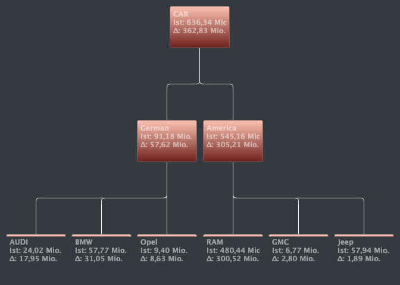

Stephen Elvis Ampah
05.08.2024

``` r
library(highcharter)
```

    ## Registered S3 method overwritten by 'quantmod':
    ##   method            from
    ##   as.zoo.data.frame zoo

``` r
library(dplyr)
```

    ## 
    ## Attaching package: 'dplyr'

    ## The following objects are masked from 'package:stats':
    ## 
    ##     filter, lag

    ## The following objects are masked from 'package:base':
    ## 
    ##     intersect, setdiff, setequal, union

``` r
library(data.table)
```

    ## 
    ## Attaching package: 'data.table'

    ## The following objects are masked from 'package:dplyr':
    ## 
    ##     between, first, last

``` r
XY <- c(24015319, 480442671, 57765129, 6772172, 9401538, 57940350)
MN <- c(17945543, 300517552, 31052000, 2798460, 8626025, 1894563)

dt <- data.table(
  from = c("CAR", "CAR", "German", "German", "German", "America", "America", "America"),
  to = c("German", "America", "AUDI", "BMW", "Opel", "RAM", "GMC", "Jeep")
)

# Customize tooltip to show XY and MN values for links and nodes
Tooltip <- JS(
  "function() {
      let total_xy = 0;
      let total_mn = 0;
      if (this.point.id === 'German') {
        ['AUDI', 'BMW', 'Opel'].forEach(function(id) {
          let node = this.series.nodes.find(node => node.id === id);
          if (node) {
            total_xy += node.xy;
            total_mn += node.mn;
          }
        }, this);
        return this.point.name + '<br>Total: ' + total_xy.toLocaleString('de-DE') + '<br>Change: ' + total_mn.toLocaleString('de-DE');
      } else if (this.point.id === 'America') {
        ['RAM', 'GMC', 'Jeep'].forEach(function(id) {
          let node = this.series.nodes.find(node => node.id === id);
          if (node) {
            total_xy += node.xy;
            total_mn += node.mn;
          }
        }, this);
        return this.point.name + '<br>Total: ' + total_xy.toLocaleString('de-DE') + '<br>Change: ' + total_mn.toLocaleString('de-DE');
      } else if (this.point.id === 'AUDI' || this.point.id === 'BMW' || this.point.id === 'Opel' || this.point.id === 'RAM' || this.point.id === 'GMC' || this.point.id === 'Jeep') {
        return this.point.name + '<br>Total: ' + this.point.xy.toLocaleString('de-DE') + '<br>Change: ' + this.point.mn.toLocaleString('de-DE');
      } else if (this.point.id === 'CAR') {
        ['AUDI', 'BMW', 'Opel', 'RAM', 'GMC', 'Jeep'].forEach(function(id) {
          let node = this.series.nodes.find(node => node.id === id);
          if (node) {
            total_xy += node.xy;
            total_mn += node.mn;
          }
        }, this);
        return this.point.name + '<br>Total: ' + total_xy.toLocaleString('de-DE') + '<br>Change: ' + total_mn.toLocaleString('de-DE');
      } else {
        return this.point.name;
      }
    }"
)

Datalabel <- JS(
  "function() {
      let total_xy = 0;
      let total_mn = 0;
      if (this.point.id === 'German') {
        ['AUDI', 'BMW', 'Opel'].forEach(function(id) {
          let node = this.series.nodes.find(node => node.id === id);
          if (node) {
            total_xy += node.xy;
            total_mn += node.mn;
          }
        }, this);
        return this.point.name + '<br>Ist: ' + Highcharts.numberFormat(total_xy/1000000, 2, ',', '.') + ' Mio.<br>Δ: ' + Highcharts.numberFormat(total_mn/1000000, 2, ',', '.') + ' Mio.';
      } else if (this.point.id === 'America') {
        ['RAM', 'GMC', 'Jeep'].forEach(function(id) {
          let node = this.series.nodes.find(node => node.id === id);
          if (node) {
            total_xy += node.xy;
            total_mn += node.mn;
          }
        }, this);
        return this.point.name + '<br>Ist: ' + Highcharts.numberFormat(total_xy/1000000, 2, ',', '.') + ' Mio.<br>Δ: ' + Highcharts.numberFormat(total_mn/1000000, 2, ',', '.') + ' Mio.';
      } else if (this.point.id === 'AUDI' || this.point.id === 'BMW' || this.point.id === 'Opel' || this.point.id === 'RAM' || this.point.id === 'GMC' || this.point.id === 'Jeep') {
        return this.point.name + '<br>Ist: ' + Highcharts.numberFormat(this.point.xy/1000000, 2, ',', '.') + ' Mio.<br>Δ: ' + Highcharts.numberFormat(this.point.mn/1000000, 2, ',', '.') + ' Mio.';
      } else if (this.point.id === 'CAR') {
        ['AUDI', 'BMW', 'Opel', 'RAM', 'GMC', 'Jeep'].forEach(function(id) {
          let node = this.series.nodes.find(node => node.id === id);
          if (node) {
            total_xy += node.xy;
            total_mn += node.mn;
          }
        }, this);
        return this.point.name + '<br>Ist: ' + Highcharts.numberFormat(total_xy/1000000, 2, ',', '.') + ' Mio.<br>Δ: ' + Highcharts.numberFormat(total_mn/1000000, 2, ',', '.') + ' Mio.';
      } else {
        return this.point.name;
      }
    }"
)


highchart() %>%
  
  hc_chart(inverted = TRUE,
           backgroundColor = "#343A40"
  ) %>%
  
  ## The plotOptions is a wrapper object for the configuration of objects for each series type
  hc_plotOptions(organization = list(
    linkColor = "#f8f9fa",
    nodeWidth = 70,
    height = 70
  )) %>%
  
  hc_add_series(data = dt,
                type = "organization",
                colorByPoint = FALSE,
                color = list(
                  linearGradient = list(x1 = 0, y1 = 0, x2 = 1, y2 = 0),
                  stops = list(
                    c(0, "#6F201A"),
                    c(1, "#FFC3B3"))),
                dataLabels = list(
                  enabled = TRUE,
                  useHTML = TRUE,
                  style = list(
                    color = "#f8f9fa",
                    fontSize = "12px",
                    fontWeight = "bold",
                    textOutline = FALSE
                  ),
                  # crop = FALSE,
                  # allowOverlap = TRUE,
                  nodeFormatter = Datalabel
                ),
                
                nodes = list(
                  list(id = "AUDI", xy = XY[1], mn = MN[1]), 
                  list(id = "RAM", xy = XY[2], mn = MN[2]),
                  list(id = "BMW", xy = XY[3], mn = MN[3]),
                  list(id = "GMC", xy = XY[4], mn = MN[4]),
                  list(id = "Opel", xy = XY[5], mn = MN[5]),
                  list(id = "Jeep", xy = XY[6], mn = MN[6]),
                  list(id = "CAR"),
                  list(id = "German"),
                  list(id = "America")
                )
                
  ) %>%
  
  # Tooltip enables the hovering effect to take place
  hc_tooltip(
    enabled = TRUE,
    useHTML = TRUE,
    className = NULL,
    formatter = Tooltip
  )
```

    ## PhantomJS not found. You can install it with webshot::install_phantomjs(). If it is installed, please make sure the phantomjs executable can be found via the PATH variable.

<!-- -->
