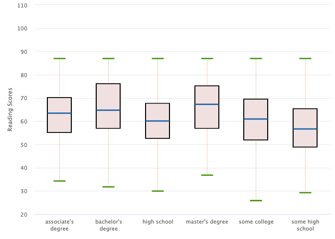
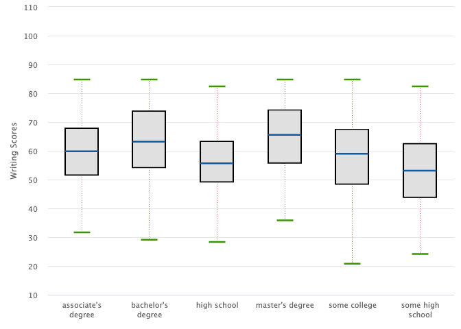

Effect of Students Score
================

``` r
# This project entails predicting the Students Performance in Exams for students in various subjects by high school Students from the United States.

# Highcharter package will be used for some visualization in this project

# Logistics Regression, Random forest and Dicision Tree will be used to build predictive models to see which model is the best predictor of the students performance in the exams after exploring the data

# Loading packages neebed in R for the entile project

      library(highcharter)
```

    ## Registered S3 method overwritten by 'quantmod':
    ##   method            from
    ##   as.zoo.data.frame zoo

``` r
      library(tidyverse)
```

    ## ── Attaching core tidyverse packages ──────────────────────── tidyverse 2.0.0 ──
    ## ✔ dplyr     1.1.4     ✔ readr     2.1.5
    ## ✔ forcats   1.0.0     ✔ stringr   1.5.1
    ## ✔ ggplot2   3.5.1     ✔ tibble    3.2.1
    ## ✔ lubridate 1.9.3     ✔ tidyr     1.3.1
    ## ✔ purrr     1.0.2

    ## ── Conflicts ────────────────────────────────────────── tidyverse_conflicts() ──
    ## ✖ dplyr::filter() masks stats::filter()
    ## ✖ dplyr::lag()    masks stats::lag()
    ## ℹ Use the conflicted package (<http://conflicted.r-lib.org/>) to force all conflicts to become errors

``` r
      library(skimr)
      library(corrplot)
```

    ## corrplot 0.92 loaded

``` r
      library(randomForest)
```

    ## randomForest 4.7-1.1
    ## Type rfNews() to see new features/changes/bug fixes.
    ## 
    ## Attaching package: 'randomForest'
    ## 
    ## The following object is masked from 'package:dplyr':
    ## 
    ##     combine
    ## 
    ## The following object is masked from 'package:ggplot2':
    ## 
    ##     margin

``` r
      library(caTools)
      library(ROCR)
      # library(InformationValue)
      library(e1071)
      library(DAAG)
```

    ## Warning: package 'DAAG' was built under R version 4.3.3

``` r
      library(party)
```

    ## Loading required package: grid
    ## Loading required package: mvtnorm

    ## Warning: package 'mvtnorm' was built under R version 4.3.3

    ## Loading required package: modeltools
    ## Loading required package: stats4
    ## Loading required package: strucchange
    ## Loading required package: zoo
    ## 
    ## Attaching package: 'zoo'
    ## 
    ## The following objects are masked from 'package:base':
    ## 
    ##     as.Date, as.Date.numeric
    ## 
    ## Loading required package: sandwich
    ## 
    ## Attaching package: 'strucchange'
    ## 
    ## The following object is masked from 'package:stringr':
    ## 
    ##     boundary
    ## 
    ## 
    ## Attaching package: 'party'
    ## 
    ## The following object is masked from 'package:dplyr':
    ## 
    ##     where

``` r
      library(rpart)
      library(rpart.plot)
      library(mlbench)
      library(caret)
```

    ## Loading required package: lattice
    ## 
    ## Attaching package: 'caret'
    ## 
    ## The following object is masked from 'package:purrr':
    ## 
    ##     lift

``` r
      library(pROC)
```

    ## Type 'citation("pROC")' for a citation.
    ## 
    ## Attaching package: 'pROC'
    ## 
    ## The following objects are masked from 'package:stats':
    ## 
    ##     cov, smooth, var

``` r
      library(tree)
      library(rmarkdown)
```

    ## Warning: package 'rmarkdown' was built under R version 4.3.3

``` r
      library(webshot2)
      library(htmlwidgets)
```

``` r
# loading and showing some overview of the data 
getwd()
```

    ## [1] "/Users/stephenampah/Documents/SP"

``` r
Raw_data <- read.csv("/Users/stephenampah/Documents/Thesis/exams.csv")

    attach(Raw_data)
    names(Raw_data)
```

    ## [1] "gender"                      "race.ethnicity"             
    ## [3] "parental.level.of.education" "lunch"                      
    ## [5] "test.preparation.course"     "math.score"                 
    ## [7] "reading.score"               "writing.score"

``` r
# Summary statistics of the data by applying skim functions
summary(Raw_data)
```

    ##     gender          race.ethnicity     parental.level.of.education
    ##  Length:1000        Length:1000        Length:1000                
    ##  Class :character   Class :character   Class :character           
    ##  Mode  :character   Mode  :character   Mode  :character           
    ##                                                                   
    ##                                                                   
    ##                                                                   
    ##     lunch           test.preparation.course   math.score    reading.score
    ##  Length:1000        Length:1000             Min.   : 13.0   Min.   : 27  
    ##  Class :character   Class :character        1st Qu.: 56.0   1st Qu.: 60  
    ##  Mode  :character   Mode  :character        Median : 66.5   Median : 70  
    ##                                             Mean   : 66.4   Mean   : 69  
    ##                                             3rd Qu.: 77.0   3rd Qu.: 79  
    ##                                             Max.   :100.0   Max.   :100  
    ##  writing.score   
    ##  Min.   : 23.00  
    ##  1st Qu.: 58.00  
    ##  Median : 68.00  
    ##  Mean   : 67.74  
    ##  3rd Qu.: 79.00  
    ##  Max.   :100.00

``` r
skim(Raw_data)
```

|                                                  |          |
|:-------------------------------------------------|:---------|
| Name                                             | Raw_data |
| Number of rows                                   | 1000     |
| Number of columns                                | 8        |
| \_\_\_\_\_\_\_\_\_\_\_\_\_\_\_\_\_\_\_\_\_\_\_   |          |
| Column type frequency:                           |          |
| character                                        | 5        |
| numeric                                          | 3        |
| \_\_\_\_\_\_\_\_\_\_\_\_\_\_\_\_\_\_\_\_\_\_\_\_ |          |
| Group variables                                  | None     |

Data summary

**Variable type: character**

| skim_variable               | n_missing | complete_rate | min | max | empty | n_unique | whitespace |
|:----------------------------|----------:|--------------:|----:|----:|------:|---------:|-----------:|
| gender                      |         0 |             1 |   4 |   6 |     0 |        2 |          0 |
| race.ethnicity              |         0 |             1 |   7 |   7 |     0 |        5 |          0 |
| parental.level.of.education |         0 |             1 |  11 |  18 |     0 |        6 |          0 |
| lunch                       |         0 |             1 |   8 |  12 |     0 |        2 |          0 |
| test.preparation.course     |         0 |             1 |   4 |   9 |     0 |        2 |          0 |

**Variable type: numeric**

| skim_variable | n_missing | complete_rate |  mean |    sd |  p0 | p25 |  p50 | p75 | p100 | hist  |
|:--------------|----------:|--------------:|------:|------:|----:|----:|-----:|----:|-----:|:------|
| math.score    |         0 |             1 | 66.40 | 15.40 |  13 |  56 | 66.5 |  77 |  100 | ▁▂▇▇▃ |
| reading.score |         0 |             1 | 69.00 | 14.74 |  27 |  60 | 70.0 |  79 |  100 | ▁▃▇▇▃ |
| writing.score |         0 |             1 | 67.74 | 15.60 |  23 |  58 | 68.0 |  79 |  100 | ▁▃▇▇▃ |

The skim function helps one to know: 1. the dimension, the minimum and
maximum values of the data 2. the mean and the standard deviation of the
various numeric variables 3. if there are missing values 4. the unique
numbers, how the the data is distributed and some other important things

``` r
# Now we try visualizing the variables to check potential outlier, using box plot

### CHECKING OUTLIERS IN THE PAREANTAL LEVEL OF EDUCATION AS AGAINST EACH SCORE
    
    ## Maths Score
    Raw_data1 <- data_to_boxplot(Raw_data, math.score, parental.level.of.education)
    highchart() %>%
      hc_plotOptions(boxplot = list(
        fillColor = '#F0F0E0',
        lineWidth = 2,
        medianColor = '#0C5DA5',
        medianWidth = 3,
        stemColor = '#A63400',
        stemDashStyle = 'dot',
        stemWidth = 1,
        whiskerColor = '#3D9200',
        whiskerLength = '50%',
        whiskerWidth = 3,
        color = 'black'
      ))  %>% 
      hc_xAxis(type = "category") %>%
      hc_yAxis(title = list(text = "Maths Scores"))%>%
      hc_legend(enabled = F)%>%
      hc_add_series_list(Raw_data1)
```

    ## PhantomJS not found. You can install it with webshot::install_phantomjs(). If it is installed, please make sure the phantomjs executable can be found via the PATH variable.

<!-- -->

``` r
    ## Reading Score
    Raw_data1 <- data_to_boxplot(Raw_data, reading.score, parental.level.of.education)
    highchart() %>%
      hc_plotOptions(boxplot = list(
        fillColor = '#F0E0E0',
        lineWidth = 2,
        medianColor = '#0C5DA5',
        medianWidth = 3,
        stemColor = '#A63400',
        stemDashStyle = 'dot',
        stemWidth = 1,
        whiskerColor = '#3D9200',
        whiskerLength = '50%',
        whiskerWidth = 3,
        color = 'black'
      ))  %>% 
      hc_xAxis(type = "category") %>%
      hc_yAxis(title = list(text = "Reading Scores"))%>%
      hc_legend(enabled = F)%>%
      hc_add_series_list(Raw_data1)
```

<!-- -->

``` r
    ## Writing Score
    Raw_data1 <- data_to_boxplot(Raw_data, writing.score, parental.level.of.education)
    highchart() %>%
      hc_plotOptions(boxplot = list(
        fillColor = '#E0E0E0',
        lineWidth = 2,
        medianColor = '#0C5DA5',
        medianWidth = 3,
        stemColor = '#A63400',
        stemDashStyle = 'dot',
        stemWidth = 1,
        whiskerColor = '#3D9200',
        whiskerLength = '50%',
        whiskerWidth = 3,
        color = 'black'
      ))  %>% 
      hc_xAxis(type = "category") %>%
      hc_yAxis(title = list(text = "Writing Scores"))%>%
      hc_legend(enabled = F)%>%
      hc_add_series_list(Raw_data1)
```

<!-- --> It can clearly
be said that there are no outlier in the various scores.

We proceed with how the dataset distributed with Gender by way of Pie
chart

``` r
##### How is the distribution of Gender in the dataset #####
    
    ### Math
    summary_gender_math <- Raw_data %>% group_by(gender) %>% 
      summarise(Total = sum(math.score)) %>% mutate(percentage = Total/sum(Total))
    
    hc <- summary_gender_math %>%
      hchart("pie", hcaes(x = gender, y = "Total"),
             borderWidth = 0,
             dataLabels = list(enabled = T, 
                               distance = -67,
                               style = list(color = "#rf8f9fa",
                                            textOutline = F,
                                            fontWeight = 'bold',
                                            fontSize = 18),
                               format = '<b>{point.name}</b>: {point.percentage:.1f} %',
                               connectorColor = 'silver'))%>%
    hc_colors(c("#fc8eac",
                "#00ccff"))%>%
    hc_title(text = "Distribution of Gender by Maths Score",
             style = list(color = "#rf8f9fa",
                          textOutline = F,
                          fontWeight = 'bold',
                          fontSize = 18))%>%
    hc_tooltip(pointFormat = '<b>{point.y:.1f}</b>')
       
    # Save the widget as an HTML file
    saveWidget(hc, "plot.html", selfcontained = FALSE)
    
    # Use webshot to convert it to an image
    webshot2::webshot("plot.html", "plot.png", delay = 5)
```

<!-- -->

``` r
### Reading
    summary_gender_reading <- Raw_data %>% group_by(gender) %>% 
      summarise(Total = sum(reading.score)) %>% mutate(percentage = Total/sum(Total))
    
    hc <- summary_gender_reading %>%
      hchart("pie", hcaes(x = gender, y = "Total"),
             borderWidth = 0,
             dataLabels = list(enabled = T, 
                               distance = -67,
                               style = list(color = "#rf8f9fa",
                                            textOutline = F,
                                            fontWeight = 'bold',
                                            fontSize = 18),
                               format = '<b>{point.name}</b>: {point.percentage:.1f} %',
                               connectorColor = 'silver'))%>%
      hc_colors(c("#fc8eac",
                  "#00ccff"))%>%
      hc_title(text = "Distribution of Gender by Reading Score",
               style = list(color = "#rf8f9fa",
                            textOutline = F,
                            fontWeight = 'bold',
                            fontSize = 18))%>%
      hc_tooltip(pointFormat = '<b>{point.y:.1f}</b>')
    
    # Save the widget as an HTML file
    saveWidget(hc, "plot.html", selfcontained = FALSE)
    
    # Use webshot to convert it to an image
    webshot2::webshot("plot.html", "plot.png", delay = 5)
```

<!-- -->

``` r
    ### Writing
    summary_gender_writing <- Raw_data %>% group_by(gender) %>% 
      summarise(Total = sum(writing.score)) %>% mutate(percentage = Total/sum(Total))
    
    hc <- summary_gender_writing %>%
      hchart("pie", hcaes(x = gender, y = "Total"),
             borderWidth = 0,
             dataLabels = list(enabled = T, 
                               distance = -67,
                               style = list(color = "#rf8f9fa",
                                            textOutline = F,
                                            fontSize = 18),
                               format = '<b>{point.name}</b>: {point.percentage:.1f} %',
                               connectorColor = 'silver'))%>%
      hc_colors(c("#fc8eac",
                  "#00ccff"))%>%
      hc_title(text = "Distribution of Gender by Writing Score",
               style = list(color = "#rf8f9fa",
                            textOutline = F,
                            fontSize = 18))%>%
      hc_tooltip(pointFormat = '<b>{point.y:.1f}</b>')
    
    # Save the widget as an HTML file
    saveWidget(hc, "plot.html", selfcontained = FALSE)
    
    # Use webshot to convert it to an image
    webshot2::webshot("plot.html", "plot.png", delay = 5)
```

<!-- -->

We proceed with Comparing Parent Education level with the child’s gender
by way of a column chart

``` r
 #### Comparing Parent Education level with the child's gender####
    
    ### Parental level of education by gender count
    summary_parent_level_edu <- Raw_data %>% group_by(parental.level.of.education)%>% count(gender)
    
    ### Setting the colours 
    summary_parent_level_edu$col <- ifelse(summary_parent_level_edu$gender == "male", '#00ccff', '#fc8eac')
    
    ### Wrapping JS code into r to show how the top column to into the bottom column
     wrapper = list(load = JS("(function (H) {
      H.wrap(H.seriesTypes.column.prototype, 'drawPoints', function (proceed) {
        let seriesIndex = this.index
          $.each(this.points, function (i,point) {
            point.shapeArgs.y -= seriesIndex == 0 ? 0 : 5;
            point.shapeArgs.height +=  5;
          });
          proceed.apply(this, Array.prototype.slice.call(arguments, 1));
      });
  }(Highcharts));
      "))
    
    ### Column chart with highcharter package
    hc <- summary_parent_level_edu %>%
      hchart("column", hcaes(x = parental.level.of.education, y = "n", group = "gender"),
             stacking = "normal",
             borderLine = F,
             events = wrapper,
             #backgroundColor = "red",
             dataLabels = list(enabled = T, 
                               distance = -67,
                               style = list(color = "#f8f9fa",
                                            textOutline = F,
                                            fontSize = 15)))%>%
      
      hc_plotOptions(series = list(
        borderRadius = 8,
        borderWidth = 0
        ))%>%
      
      hc_xAxis(title = list(
        text = 'Type of Education',
        style = list(color = "#rf8f9fa",
                     textOutline = F,
                     fontWeight = 'bold',
                     fontSize = 15)),
        labels = list(style = list(color = "#rf8f9fa",
                              textOutline = F,
                              fontWeight = 'bold',
                              fontSize = 10))
        ) %>%
      hc_yAxis(gridLineWidth = F,
               title = F,
               labels = list(style = list(color = "#rf8f9fa",
                                          textOutline = F,
                                          fontWeight = 'bold',
                                          fontSize = 10)),
               stackLabels = list(enabled = T,
                                  style = list(color = "#rf8f9fa",
                                               textOutline = F,
                                               fontWeight = 'bold',
                                               fontSize = 25)))%>%
      hc_title(text = "Parent Education Level with the Child's Gender",
               style = list(color = "#rf8f9fa",
                            textOutline = F,
                            fontWeight = 'bold',
                            fontSize = 18)
               #y = 90
               )%>%
     hc_legend(labelFormat = '<span style="color:{color}">{name}</span')%>%
     hc_colors(summary_parent_level_edu$col)%>%
    
      hc_tooltip(pointFormat = '{series.name}: {point.y}<br/>Total: {point.stackTotal}')
    
    # Save the widget as an HTML file
    saveWidget(hc, "plot.html", selfcontained = FALSE)
    
    # Use webshot to convert it to an image
    webshot2::webshot("plot.html", "plot.png", delay = 5)
```

<!-- -->

Comparing Students level of preparation

``` r
#### Comparing Students level of preparation  ####
    
    ### Parental level of education by gender count
    summary_test_preparation <- Raw_data %>% group_by(gender)%>% count(test.preparation.course)
    
    ### Setting the colours 
    summary_test_preparation$coll <- ifelse(summary_test_preparation$test.preparation.course == "completed", '#40e0d0', '#4d9385')
    
      ### Column chart with highcharter package
      hc <- summary_test_preparation %>%
      hchart("column", hcaes(y = "n", group = "test.preparation.course"),
             stacking = "normal",
             borderLine = F,
             dataLabels = list(enabled = T, 
                               distance = -67,
                               style = list(color = "#112d31",
                                            textOutline = F,
                                            fontSize = 15)))%>%
      hc_chart(inverted = T,
               polar = T)%>%
      
      hc_plotOptions(series = list(
        borderRadius = 5,
        pointPadding = 0,
        groupPadding = 0.15,
        borderWidth = 0))%>%
       
      hc_pane(innerSize = '20%',
              endAngle = 270)%>%

      hc_xAxis(categories = c("Male", "Female"),
               gridLineWidth = F,
               labels = list(align = "right",
                             y = 3,
                             style = list(color = "#rf8f9fa",
                                          textOutline = F,
                                          fontWeight = 'bold',
                                          fontSize = 20)),
               stackLabels = list(enabled = T,
                                  style = list(color = "#rf8f9fa",
                                               textOutline = F,
                                               fontWeight = 'bold',
                                               fontSize = 15))) %>%
      hc_yAxis(visible = F, 
               stackLabels = list(enabled = T,
                                  style = list(color = "#rf8f9fa",
                                               textOutline = F,
                                               fontWeight = 'bold',
                                               fontSize = 15)))%>%
      hc_title(text = "Radial chart showing whether Student Prepared for the Exams",
               style = list(color = "#rf8f9fa",
                            textOutline = F,
                            fontWeight = 'bold',
                            fontSize = 18),
               y = 50)%>%
      hc_legend(labelFormat = '<span style="color:{color}">{name}</span')%>%
      hc_colors(summary_test_preparation$coll)
    
      # Save the widget as an HTML file
    saveWidget(hc, "plot.html", selfcontained = FALSE)
    
    # Use webshot to convert it to an image
    webshot2::webshot("plot.html", "plot.png", delay = 5)
```

<!-- -->

Predictions with: Logistics Regression, Random forest Dicision Tree All
predictions are based on the train data set

``` r
####Data Perparation for Prediction using Parental Level of Education #####
    ## Mapping Raw_data to Final_data
    Final_data <- data.frame(Raw_data)
    
    ### ifelse Condition to assign cathegories to Parent level of education
    Final_data$Parent.level <- ifelse(Raw_data$parental.level.of.education == "high school", 1, 
                        ifelse(Raw_data$parental.level.of.education == "some high school", 2,
                               ifelse(Raw_data$parental.level.of.education == "some college", 3,
                                      ifelse(Raw_data$parental.level.of.education == "associate's degree", 4,
                                             ifelse(Raw_data$parental.level.of.education == "bachelor's degree", 5, 0)))))

    
    ## comverting parent level to factor
    Final_data$Parent.level.edu <- as.factor(Final_data$Parent.level)
    str(Final_data)
```

    ## 'data.frame':    1000 obs. of  10 variables:
    ##  $ gender                     : chr  "male" "female" "male" "male" ...
    ##  $ race.ethnicity             : chr  "group A" "group D" "group E" "group B" ...
    ##  $ parental.level.of.education: chr  "high school" "some high school" "some college" "high school" ...
    ##  $ lunch                      : chr  "standard" "free/reduced" "free/reduced" "standard" ...
    ##  $ test.preparation.course    : chr  "completed" "none" "none" "none" ...
    ##  $ math.score                 : int  67 40 59 77 78 63 62 93 63 47 ...
    ##  $ reading.score              : int  67 59 60 78 73 77 59 88 56 42 ...
    ##  $ writing.score              : int  63 55 50 68 68 76 63 84 65 45 ...
    ##  $ Parent.level               : num  1 2 3 1 4 1 5 3 1 3 ...
    ##  $ Parent.level.edu           : Factor w/ 6 levels "0","1","2","3",..: 2 3 4 2 5 2 6 4 2 4 ...

We start with Logistic Regression Model for the prediction on parental
level of education

``` r
#splitting data into train and test dataset
    set.seed(1254)
    n<- dim(Final_data)[1]
    
    ind <- sample(1:n,n*0.7, replace=F)
    
    train_data <- Final_data[ind,]
    test_data <- Final_data[-ind,]
    
    
    #fit logistic regression model
    model <- glm(Parent.level.edu ~ math.score + reading.score + writing.score, family="binomial", data=train_data)
    summary(model)
```

    ## 
    ## Call:
    ## glm(formula = Parent.level.edu ~ math.score + reading.score + 
    ##     writing.score, family = "binomial", data = train_data)
    ## 
    ## Coefficients:
    ##                Estimate Std. Error z value Pr(>|z|)    
    ## (Intercept)    4.938982   0.838875   5.888 3.92e-09 ***
    ## math.score     0.008948   0.017465   0.512  0.60840    
    ## reading.score  0.042141   0.034948   1.206  0.22789    
    ## writing.score -0.083955   0.032585  -2.576  0.00998 ** 
    ## ---
    ## Signif. codes:  0 '***' 0.001 '**' 0.01 '*' 0.05 '.' 0.1 ' ' 1
    ## 
    ## (Dispersion parameter for binomial family taken to be 1)
    ## 
    ##     Null deviance: 355.09  on 699  degrees of freedom
    ## Residual deviance: 338.16  on 696  degrees of freedom
    ## AIC: 346.16
    ## 
    ## Number of Fisher Scoring iterations: 6

``` r
    # predicting train data based on the model
    pred_model <- predict(model, Temp_data = train_data,type="response")
    
    # Changing probabilities
    predict_reg <- ifelse(pred_model >0.5, 1, 0)
    
    # Convert to factor: p_class
    p_class <- factor(predict_reg, levels = levels(train_data$Parent.level.edu))
    
    ## Generating confusion matrix
    confusionMatrix(p_class , train_data$Parent.level.edu)
```

    ## Confusion Matrix and Statistics
    ## 
    ##           Reference
    ## Prediction   0   1   2   3   4   5
    ##          0   0   0   0   0   0   0
    ##          1  49 154 145 142 127  83
    ##          2   0   0   0   0   0   0
    ##          3   0   0   0   0   0   0
    ##          4   0   0   0   0   0   0
    ##          5   0   0   0   0   0   0
    ## 
    ## Overall Statistics
    ##                                           
    ##                Accuracy : 0.22            
    ##                  95% CI : (0.1898, 0.2525)
    ##     No Information Rate : 0.22            
    ##     P-Value [Acc > NIR] : 0.5148          
    ##                                           
    ##                   Kappa : 0               
    ##                                           
    ##  Mcnemar's Test P-Value : NA              
    ## 
    ## Statistics by Class:
    ## 
    ##                      Class: 0 Class: 1 Class: 2 Class: 3 Class: 4 Class: 5
    ## Sensitivity              0.00     1.00   0.0000   0.0000   0.0000   0.0000
    ## Specificity              1.00     0.00   1.0000   1.0000   1.0000   1.0000
    ## Pos Pred Value            NaN     0.22      NaN      NaN      NaN      NaN
    ## Neg Pred Value           0.93      NaN   0.7929   0.7971   0.8186   0.8814
    ## Prevalence               0.07     0.22   0.2071   0.2029   0.1814   0.1186
    ## Detection Rate           0.00     0.22   0.0000   0.0000   0.0000   0.0000
    ## Detection Prevalence     0.00     1.00   0.0000   0.0000   0.0000   0.0000
    ## Balanced Accuracy        0.50     0.50   0.5000   0.5000   0.5000   0.5000

We proceed with Random Forest Model for the prediction on parental level
of education

``` r
#splitting data into train and test dataset
    set.seed(1234)
    n<- dim(Final_data)[1]
    
    ind <- sample(1:n,n*0.7, replace=F)
    
    train_data <- Final_data[ind,]
    test_data <- Final_data[-ind,]
    
### Train Data    
#we begin with a random variable classifier model using 3000 trees
    set.seed(1224)
    rf.class <- randomForest(Parent.level.edu ~ math.score + writing.score + reading.score, data=train_data, ntree=3000)
    print(rf.class)
```

    ## 
    ## Call:
    ##  randomForest(formula = Parent.level.edu ~ math.score + writing.score +      reading.score, data = train_data, ntree = 3000) 
    ##                Type of random forest: classification
    ##                      Number of trees: 3000
    ## No. of variables tried at each split: 1
    ## 
    ##         OOB estimate of  error rate: 82.71%
    ## Confusion matrix:
    ##    0  1  2  3  4  5 class.error
    ## 0  1  6  9 15 12  7   0.9800000
    ## 1  5 37 33 40 25  6   0.7465753
    ## 2  6 44 21 26 31  8   0.8455882
    ## 3 10 40 19 30 36 17   0.8026316
    ## 4  7 24 30 38 27 10   0.8014706
    ## 5  6 13  8 30 18  5   0.9375000

``` r
    # Showing variable of important
    varImpPlot(rf.class)
```

<!-- -->

``` r
    #Class prediction (majority vote) -  predicting with train datasets and confusion matrix to assess predictive performance
    class.pred <- predict(rf.class, data = train_data)
    confusionMatrix(class.pred, train_data$Parent.level.edu)
```

    ## Confusion Matrix and Statistics
    ## 
    ##           Reference
    ## Prediction  0  1  2  3  4  5
    ##          0  1  5  6 10  7  6
    ##          1  6 37 44 40 24 13
    ##          2  9 33 21 19 30  8
    ##          3 15 40 26 30 38 30
    ##          4 12 25 31 36 27 18
    ##          5  7  6  8 17 10  5
    ## 
    ## Overall Statistics
    ##                                           
    ##                Accuracy : 0.1729          
    ##                  95% CI : (0.1456, 0.2029)
    ##     No Information Rate : 0.2171          
    ##     P-Value [Acc > NIR] : 0.9985          
    ##                                           
    ##                   Kappa : -0.0228         
    ##                                           
    ##  Mcnemar's Test P-Value : 0.5033          
    ## 
    ## Statistics by Class:
    ## 
    ##                      Class: 0 Class: 1 Class: 2 Class: 3 Class: 4 Class: 5
    ## Sensitivity          0.020000  0.25342   0.1544  0.19737  0.19853 0.062500
    ## Specificity          0.947692  0.77076   0.8245  0.72810  0.78369 0.922581
    ## Pos Pred Value       0.028571  0.22561   0.1750  0.16760  0.18121 0.094340
    ## Neg Pred Value       0.926316  0.79664   0.8017  0.76583  0.80218 0.884080
    ## Prevalence           0.071429  0.20857   0.1943  0.21714  0.19429 0.114286
    ## Detection Rate       0.001429  0.05286   0.0300  0.04286  0.03857 0.007143
    ## Detection Prevalence 0.050000  0.23429   0.1714  0.25571  0.21286 0.075714
    ## Balanced Accuracy    0.483846  0.51209   0.4894  0.46274  0.49111 0.492540

``` r
    #plotting the errror rate
    plot(rf.class)
```

<!-- -->

We conclude with Decision Trees Model for the prediction on parental
level of education

``` r
#######Decision Trees########
    ##Classification Tree##
    
#Data Partition#
        set.seed(1234)
        n<- dim(Final_data)[1]
        
        ind <- sample(1:n,n*0.7, replace=F)
        
        train_data <- Final_data[ind,]
        test_data <- Final_data[-ind,]
        
      set.seed(2225)
      ## Tree Classification
      tree <- rpart(Parent.level.edu ~., data = train_data)
      rpart.plot(tree)
```

<!-- -->

``` r
      printcp(tree)
```

    ## 
    ## Classification tree:
    ## rpart(formula = Parent.level.edu ~ ., data = train_data)
    ## 
    ## Variables actually used in tree construction:
    ## [1] parental.level.of.education
    ## 
    ## Root node error: 548/700 = 0.78286
    ## 
    ## n= 700 
    ## 
    ##         CP nsplit rel error   xerror     xstd
    ## 1 0.266423      0  1.000000 1.056569 0.018256
    ## 2 0.248175      1  0.733577 0.715328 0.023966
    ## 3 0.145985      3  0.237226 0.237226 0.018775
    ## 4 0.091241      4  0.091241 0.091241 0.012434
    ## 5 0.010000      5  0.000000 0.000000 0.000000

``` r
      ##Method 1 Classification tree:
      rpart(formula = Parent.level.edu ~ ., data = train_data)
```

    ## n= 700 
    ## 
    ## node), split, n, loss, yval, (yprob)
    ##       * denotes terminal node
    ## 
    ##  1) root 700 548 3 (0.071 0.21 0.19 0.22 0.19 0.11)  
    ##    2) parental.level.of.education=associate's degree,bachelor's degree,high school,master's degree,some high school 548 402 1 (0.091 0.27 0.25 0 0.25 0.15)  
    ##      4) parental.level.of.education=high school 146   0 1 (0 1 0 0 0 0) *
    ##      5) parental.level.of.education=associate's degree,bachelor's degree,master's degree,some high school 402 266 2 (0.12 0 0.34 0 0.34 0.2)  
    ##       10) parental.level.of.education=some high school 136   0 2 (0 0 1 0 0 0) *
    ##       11) parental.level.of.education=associate's degree,bachelor's degree,master's degree 266 130 4 (0.19 0 0 0 0.51 0.3)  
    ##         22) parental.level.of.education=bachelor's degree,master's degree 130  50 5 (0.38 0 0 0 0 0.62)  
    ##           44) parental.level.of.education=master's degree 50   0 0 (1 0 0 0 0 0) *
    ##           45) parental.level.of.education=bachelor's degree 80   0 5 (0 0 0 0 0 1) *
    ##         23) parental.level.of.education=associate's degree 136   0 4 (0 0 0 0 1 0) *
    ##    3) parental.level.of.education=some college 152   0 3 (0 0 0 1 0 0) *

``` r
      ##Coefficient of Variation  
      plotcp(tree)
```

<!-- -->

``` r
      ## Choosing a complexity parameter (cp) to prune the tree
      tree <- rpart(Parent.level.edu ~., data = train_data,cp=0.010000)
      summary(tree)
```

    ## Call:
    ## rpart(formula = Parent.level.edu ~ ., data = train_data, cp = 0.01)
    ##   n= 700 
    ## 
    ##           CP nsplit  rel error     xerror       xstd
    ## 1 0.26642336      0 1.00000000 1.06934307 0.01782673
    ## 2 0.24817518      1 0.73357664 0.73357664 0.02387215
    ## 3 0.14598540      3 0.23722628 0.23722628 0.01877498
    ## 4 0.09124088      4 0.09124088 0.09124088 0.01243404
    ## 5 0.01000000      5 0.00000000 0.00000000 0.00000000
    ## 
    ## Variable importance
    ## parental.level.of.education                Parent.level 
    ##                          59                          30 
    ##               writing.score               reading.score 
    ##                           4                           3 
    ##                  math.score              race.ethnicity 
    ##                           2                           1 
    ##                      gender 
    ##                           1 
    ## 
    ## Node number 1: 700 observations,    complexity param=0.2664234
    ##   predicted class=3  expected loss=0.7828571  P(node) =1
    ##     class counts:    50   146   136   152   136    80
    ##    probabilities: 0.071 0.209 0.194 0.217 0.194 0.114 
    ##   left son=2 (548 obs) right son=3 (152 obs)
    ##   Primary splits:
    ##       parental.level.of.education splits as  LLLLRL,   improve=145.625200, (0 missing)
    ##       Parent.level                < 2.5  to the left,  improve=128.863400, (0 missing)
    ##       writing.score               < 81.5 to the left,  improve=  6.532794, (0 missing)
    ##       math.score                  < 45.5 to the left,  improve=  4.766190, (0 missing)
    ##       reading.score               < 86.5 to the left,  improve=  3.915168, (0 missing)
    ## 
    ## Node number 2: 548 observations,    complexity param=0.2481752
    ##   predicted class=1  expected loss=0.7335766  P(node) =0.7828571
    ##     class counts:    50   146   136     0   136    80
    ##    probabilities: 0.091 0.266 0.248 0.000 0.248 0.146 
    ##   left son=4 (146 obs) right son=5 (402 obs)
    ##   Primary splits:
    ##       parental.level.of.education splits as  RRLR-R,   improve=137.516900, (0 missing)
    ##       Parent.level                < 1.5  to the left,  improve=122.140600, (0 missing)
    ##       writing.score               < 81.5 to the left,  improve=  8.139968, (0 missing)
    ##       math.score                  < 76.5 to the left,  improve=  5.728141, (0 missing)
    ##       reading.score               < 86.5 to the left,  improve=  4.979249, (0 missing)
    ##   Surrogate splits:
    ##       Parent.level  < 1.5  to the left,  agree=0.909, adj=0.658, (0 split)
    ##       reading.score < 33.5 to the left,  agree=0.737, adj=0.014, (0 split)
    ##       writing.score < 27.5 to the left,  agree=0.735, adj=0.007, (0 split)
    ## 
    ## Node number 3: 152 observations
    ##   predicted class=3  expected loss=0  P(node) =0.2171429
    ##     class counts:     0     0     0   152     0     0
    ##    probabilities: 0.000 0.000 0.000 1.000 0.000 0.000 
    ## 
    ## Node number 4: 146 observations
    ##   predicted class=1  expected loss=0  P(node) =0.2085714
    ##     class counts:     0   146     0     0     0     0
    ##    probabilities: 0.000 1.000 0.000 0.000 0.000 0.000 
    ## 
    ## Node number 5: 402 observations,    complexity param=0.2481752
    ##   predicted class=2  expected loss=0.6616915  P(node) =0.5742857
    ##     class counts:    50     0   136     0   136    80
    ##    probabilities: 0.124 0.000 0.338 0.000 0.338 0.199 
    ##   left son=10 (136 obs) right son=11 (266 obs)
    ##   Primary splits:
    ##       parental.level.of.education splits as  RR-R-L,   improve=124.833300, (0 missing)
    ##       Parent.level                < 3    to the left,  improve=113.981800, (0 missing)
    ##       writing.score               < 81.5 to the left,  improve=  8.361518, (0 missing)
    ##       math.score                  < 45.5 to the left,  improve=  8.101346, (0 missing)
    ##       reading.score               < 64.5 to the left,  improve=  5.243621, (0 missing)
    ##   Surrogate splits:
    ##       Parent.level  < 3    to the left,  agree=0.876, adj=0.632, (0 split)
    ##       math.score    < 45.5 to the left,  agree=0.701, adj=0.118, (0 split)
    ##       writing.score < 53.5 to the left,  agree=0.694, adj=0.096, (0 split)
    ##       reading.score < 51.5 to the left,  agree=0.687, adj=0.074, (0 split)
    ## 
    ## Node number 10: 136 observations
    ##   predicted class=2  expected loss=0  P(node) =0.1942857
    ##     class counts:     0     0   136     0     0     0
    ##    probabilities: 0.000 0.000 1.000 0.000 0.000 0.000 
    ## 
    ## Node number 11: 266 observations,    complexity param=0.1459854
    ##   predicted class=4  expected loss=0.4887218  P(node) =0.38
    ##     class counts:    50     0     0     0   136    80
    ##    probabilities: 0.188 0.000 0.000 0.000 0.511 0.301 
    ##   left son=22 (130 obs) right son=23 (136 obs)
    ##   Primary splits:
    ##       parental.level.of.education splits as  RL-L--,   improve=101.469100, (0 missing)
    ##       Parent.level                < 4.5  to the left,  improve= 89.889240, (0 missing)
    ##       writing.score               < 81.5 to the right, improve=  7.960150, (0 missing)
    ##       reading.score               < 85.5 to the right, improve=  2.866846, (0 missing)
    ##       race.ethnicity              splits as  LLRRR,    improve=  2.195774, (0 missing)
    ##   Surrogate splits:
    ##       Parent.level   < 4.5  to the right, agree=0.812, adj=0.615, (0 split)
    ##       writing.score  < 81.5 to the right, agree=0.632, adj=0.246, (0 split)
    ##       reading.score  < 78.5 to the right, agree=0.575, adj=0.131, (0 split)
    ##       gender         splits as  LR,       agree=0.568, adj=0.115, (0 split)
    ##       race.ethnicity splits as  LLRRR,    agree=0.553, adj=0.085, (0 split)
    ## 
    ## Node number 22: 130 observations,    complexity param=0.09124088
    ##   predicted class=5  expected loss=0.3846154  P(node) =0.1857143
    ##     class counts:    50     0     0     0     0    80
    ##    probabilities: 0.385 0.000 0.000 0.000 0.000 0.615 
    ##   left son=44 (50 obs) right son=45 (80 obs)
    ##   Primary splits:
    ##       parental.level.of.education splits as  -R-L--,   improve=61.5384600, (0 missing)
    ##       Parent.level                < 2.5  to the left,  improve=61.5384600, (0 missing)
    ##       race.ethnicity              splits as  LLRRR,    improve= 2.6771780, (0 missing)
    ##       writing.score               < 53.5 to the left,  improve= 0.6217312, (0 missing)
    ##       reading.score               < 95.5 to the right, improve= 0.5650915, (0 missing)
    ##   Surrogate splits:
    ##       Parent.level   < 2.5  to the left,  agree=1.000, adj=1.00, (0 split)
    ##       race.ethnicity splits as  RLRRR,    agree=0.646, adj=0.08, (0 split)
    ##       writing.score  < 48   to the left,  agree=0.631, adj=0.04, (0 split)
    ##       math.score     < 42.5 to the left,  agree=0.623, adj=0.02, (0 split)
    ##       reading.score  < 95.5 to the right, agree=0.623, adj=0.02, (0 split)
    ## 
    ## Node number 23: 136 observations
    ##   predicted class=4  expected loss=0  P(node) =0.1942857
    ##     class counts:     0     0     0     0   136     0
    ##    probabilities: 0.000 0.000 0.000 0.000 1.000 0.000 
    ## 
    ## Node number 44: 50 observations
    ##   predicted class=0  expected loss=0  P(node) =0.07142857
    ##     class counts:    50     0     0     0     0     0
    ##    probabilities: 1.000 0.000 0.000 0.000 0.000 0.000 
    ## 
    ## Node number 45: 80 observations
    ##   predicted class=5  expected loss=0  P(node) =0.1142857
    ##     class counts:     0     0     0     0     0    80
    ##    probabilities: 0.000 0.000 0.000 0.000 0.000 1.000

``` r
      # ##Confusion matrix -train
      p <- predict(tree, train_data, type = 'class')
      confusionMatrix(p, train_data$Parent.level.edu)
```

    ## Confusion Matrix and Statistics
    ## 
    ##           Reference
    ## Prediction   0   1   2   3   4   5
    ##          0  50   0   0   0   0   0
    ##          1   0 146   0   0   0   0
    ##          2   0   0 136   0   0   0
    ##          3   0   0   0 152   0   0
    ##          4   0   0   0   0 136   0
    ##          5   0   0   0   0   0  80
    ## 
    ## Overall Statistics
    ##                                      
    ##                Accuracy : 1          
    ##                  95% CI : (0.9947, 1)
    ##     No Information Rate : 0.2171     
    ##     P-Value [Acc > NIR] : < 2.2e-16  
    ##                                      
    ##                   Kappa : 1          
    ##                                      
    ##  Mcnemar's Test P-Value : NA         
    ## 
    ## Statistics by Class:
    ## 
    ##                      Class: 0 Class: 1 Class: 2 Class: 3 Class: 4 Class: 5
    ## Sensitivity           1.00000   1.0000   1.0000   1.0000   1.0000   1.0000
    ## Specificity           1.00000   1.0000   1.0000   1.0000   1.0000   1.0000
    ## Pos Pred Value        1.00000   1.0000   1.0000   1.0000   1.0000   1.0000
    ## Neg Pred Value        1.00000   1.0000   1.0000   1.0000   1.0000   1.0000
    ## Prevalence            0.07143   0.2086   0.1943   0.2171   0.1943   0.1143
    ## Detection Rate        0.07143   0.2086   0.1943   0.2171   0.1943   0.1143
    ## Detection Prevalence  0.07143   0.2086   0.1943   0.2171   0.1943   0.1143
    ## Balanced Accuracy     1.00000   1.0000   1.0000   1.0000   1.0000   1.0000

Predictions according to Test Preparation of the Course

``` r
#### Data Perparation for Prediction using Test Preparation of the Course  #####
####### Mapping Raw_data to Temp
        
        Temp_data <- data.frame(Raw_data)
        
        ### ifelse Condition to assign cathegories to Test Preparation Course
        Temp_data$preparation.level <- ifelse(Raw_data$test.preparation.course == "completed", 1, 0)
      
        Temp_data$preparation.level <- as.factor(Temp_data$preparation.level)
        str(Temp_data)
```

    ## 'data.frame':    1000 obs. of  9 variables:
    ##  $ gender                     : chr  "male" "female" "male" "male" ...
    ##  $ race.ethnicity             : chr  "group A" "group D" "group E" "group B" ...
    ##  $ parental.level.of.education: chr  "high school" "some high school" "some college" "high school" ...
    ##  $ lunch                      : chr  "standard" "free/reduced" "free/reduced" "standard" ...
    ##  $ test.preparation.course    : chr  "completed" "none" "none" "none" ...
    ##  $ math.score                 : int  67 40 59 77 78 63 62 93 63 47 ...
    ##  $ reading.score              : int  67 59 60 78 73 77 59 88 56 42 ...
    ##  $ writing.score              : int  63 55 50 68 68 76 63 84 65 45 ...
    ##  $ preparation.level          : Factor w/ 2 levels "0","1": 2 1 1 1 2 1 1 2 1 1 ...

We start with Logistic Regression Model for the prediction on test
preparation

``` r
#splitting data into train and test dataset
        set.seed(1237)
        n<- dim(Temp_data)[1]
        
        ind <- sample(1:n,n*0.7, replace=F)
        
        train_data <- Temp_data[ind,]
        test_data <- Temp_data[-ind,]
        
        #fit logistic regression model with the train data
        model <- glm(preparation.level ~ math.score + reading.score + writing.score, family="binomial",  data=train_data)
        summary(model)
```

    ## 
    ## Call:
    ## glm(formula = preparation.level ~ math.score + reading.score + 
    ##     writing.score, family = "binomial", data = train_data)
    ## 
    ## Coefficients:
    ##               Estimate Std. Error z value Pr(>|z|)    
    ## (Intercept)   -2.85900    0.43876  -6.516 7.22e-11 ***
    ## math.score    -0.03919    0.01000  -3.919 8.90e-05 ***
    ## reading.score -0.07370    0.02014  -3.660 0.000252 ***
    ## writing.score  0.14468    0.01951   7.417 1.20e-13 ***
    ## ---
    ## Signif. codes:  0 '***' 0.001 '**' 0.01 '*' 0.05 '.' 0.1 ' ' 1
    ## 
    ## (Dispersion parameter for binomial family taken to be 1)
    ## 
    ##     Null deviance: 901.37  on 699  degrees of freedom
    ## Residual deviance: 792.54  on 696  degrees of freedom
    ## AIC: 800.54
    ## 
    ## Number of Fisher Scoring iterations: 4

``` r
        # predicting train data based on the model
        pred_model <- predict(model, Temp_data = train_data,type="response")
        
        # Changing probabilities
        predict_reg <- ifelse(pred_model >0.5, 1, 0)
        
        # Convert to factor: p_class
        p_class <- factor(predict_reg, levels = levels(train_data$preparation.level))
        
        ## Generating confusion matrix
        confusionMatrix(p_class , train_data$preparation.level)
```

    ## Confusion Matrix and Statistics
    ## 
    ##           Reference
    ## Prediction   0   1
    ##          0 398 144
    ##          1  61  97
    ##                                           
    ##                Accuracy : 0.7071          
    ##                  95% CI : (0.6719, 0.7406)
    ##     No Information Rate : 0.6557          
    ##     P-Value [Acc > NIR] : 0.002143        
    ##                                           
    ##                   Kappa : 0.2936          
    ##                                           
    ##  Mcnemar's Test P-Value : 1.021e-08       
    ##                                           
    ##             Sensitivity : 0.8671          
    ##             Specificity : 0.4025          
    ##          Pos Pred Value : 0.7343          
    ##          Neg Pred Value : 0.6139          
    ##              Prevalence : 0.6557          
    ##          Detection Rate : 0.5686          
    ##    Detection Prevalence : 0.7743          
    ##       Balanced Accuracy : 0.6348          
    ##                                           
    ##        'Positive' Class : 0               
    ## 

we proceed with random forest Model for the prediction on test
preparation

``` r
#splitting data into train and test dataset
        set.seed(1234)
        n<- dim(Temp_data)[1]
        
        ind <- sample(1:n,n*0.7, replace=F)
        
        train_data <- Temp_data[ind,]
        test_data <- Temp_data[-ind,]
   
       
        #we begin with a random variable classifier model using 3000 trees
        set.seed(2239)
        rf.class <- randomForest(preparation.level ~ math.score + writing.score + reading.score, data=train_data, ntree=3000)
        print(rf.class)
```

    ## 
    ## Call:
    ##  randomForest(formula = preparation.level ~ math.score + writing.score +      reading.score, data = train_data, ntree = 3000) 
    ##                Type of random forest: classification
    ##                      Number of trees: 3000
    ## No. of variables tried at each split: 1
    ## 
    ##         OOB estimate of  error rate: 32.14%
    ## Confusion matrix:
    ##     0  1 class.error
    ## 0 390 79   0.1684435
    ## 1 146 85   0.6320346

``` r
        #Checking which of the variable is the most important in the prediction by way of ploting thr rf.class
        varImpPlot(rf.class)
```

<!-- -->

``` r
        #Class prediction (majority vote) -  predicting with train datasets and confusion matrix to assess predictive performance
        class.pred <- predict(rf.class, data = train_data)
        confusionMatrix(class.pred, train_data$preparation.level)
```

    ## Confusion Matrix and Statistics
    ## 
    ##           Reference
    ## Prediction   0   1
    ##          0 390 146
    ##          1  79  85
    ##                                           
    ##                Accuracy : 0.6786          
    ##                  95% CI : (0.6426, 0.7131)
    ##     No Information Rate : 0.67            
    ##     P-Value [Acc > NIR] : 0.3306          
    ##                                           
    ##                   Kappa : 0.2154          
    ##                                           
    ##  Mcnemar's Test P-Value : 1.083e-05       
    ##                                           
    ##             Sensitivity : 0.8316          
    ##             Specificity : 0.3680          
    ##          Pos Pred Value : 0.7276          
    ##          Neg Pred Value : 0.5183          
    ##              Prevalence : 0.6700          
    ##          Detection Rate : 0.5571          
    ##    Detection Prevalence : 0.7657          
    ##       Balanced Accuracy : 0.5998          
    ##                                           
    ##        'Positive' Class : 0               
    ## 

``` r
        #plotting the errror rate
        plot(rf.class)
```

<!-- -->

we conclude with decision tree Model for the prediction on test
preparation

``` r
#Data Partition#

         set.seed(1234)
        n<- dim(Temp_data)[1]

        ind <- sample(1:n,n*0.7, replace=F)

        train_data <- Temp_data[ind,]
        test_data <- Temp_data[-ind,]
       
        
        set.seed(2225)
        ## Tree Classification
        tree <- rpart(preparation.level ~., data = train_data)
        rpart.plot(tree)
```

<!-- -->

``` r
        printcp(tree)
```

    ## 
    ## Classification tree:
    ## rpart(formula = preparation.level ~ ., data = train_data)
    ## 
    ## Variables actually used in tree construction:
    ## [1] test.preparation.course
    ## 
    ## Root node error: 231/700 = 0.33
    ## 
    ## n= 700 
    ## 
    ##     CP nsplit rel error xerror     xstd
    ## 1 1.00      0         1      1 0.053856
    ## 2 0.01      1         0      0 0.000000

``` r
        ##Method 1 Classification tree:
        rpart(formula = preparation.level ~ ., data = train_data)
```

    ## n= 700 
    ## 
    ## node), split, n, loss, yval, (yprob)
    ##       * denotes terminal node
    ## 
    ## 1) root 700 231 0 (0.6700000 0.3300000)  
    ##   2) test.preparation.course=none 469   0 0 (1.0000000 0.0000000) *
    ##   3) test.preparation.course=completed 231   0 1 (0.0000000 1.0000000) *

``` r
        ##Coefficient of Variation  
        plotcp(tree)
```

<!-- -->

``` r
        ## Choosing a complexity parameter (cp) to prune the tree
        tree <- rpart(preparation.level ~., data = train_data,cp=0.01)
        summary(tree)
```

    ## Call:
    ## rpart(formula = preparation.level ~ ., data = train_data, cp = 0.01)
    ##   n= 700 
    ## 
    ##     CP nsplit rel error xerror       xstd
    ## 1 1.00      0         1      1 0.05385567
    ## 2 0.01      1         0      0 0.00000000
    ## 
    ## Variable importance
    ## test.preparation.course           writing.score           reading.score 
    ##                      92                       7                       1 
    ## 
    ## Node number 1: 700 observations,    complexity param=1
    ##   predicted class=0  expected loss=0.33  P(node) =1
    ##     class counts:   469   231
    ##    probabilities: 0.670 0.330 
    ##   left son=2 (469 obs) right son=3 (231 obs)
    ##   Primary splits:
    ##       test.preparation.course     splits as  RL,       improve=309.540000, (0 missing)
    ##       writing.score               < 61.5 to the left,  improve= 26.625410, (0 missing)
    ##       reading.score               < 64.5 to the left,  improve= 15.340170, (0 missing)
    ##       math.score                  < 73.5 to the left,  improve=  4.724644, (0 missing)
    ##       parental.level.of.education splits as  RRLLRR,   improve=  2.278662, (0 missing)
    ##   Surrogate splits:
    ##       writing.score < 88.5 to the left,  agree=0.694, adj=0.074, (0 split)
    ##       reading.score < 97   to the left,  agree=0.674, adj=0.013, (0 split)
    ##       math.score    < 99.5 to the left,  agree=0.671, adj=0.004, (0 split)
    ## 
    ## Node number 2: 469 observations
    ##   predicted class=0  expected loss=0  P(node) =0.67
    ##     class counts:   469     0
    ##    probabilities: 1.000 0.000 
    ## 
    ## Node number 3: 231 observations
    ##   predicted class=1  expected loss=0  P(node) =0.33
    ##     class counts:     0   231
    ##    probabilities: 0.000 1.000

``` r
        ##Confusion matrix -train
        p <- predict(tree, train_data, type = 'class')
        confusionMatrix(p, train_data$preparation.level, positive="1")
```

    ## Confusion Matrix and Statistics
    ## 
    ##           Reference
    ## Prediction   0   1
    ##          0 469   0
    ##          1   0 231
    ##                                      
    ##                Accuracy : 1          
    ##                  95% CI : (0.9947, 1)
    ##     No Information Rate : 0.67       
    ##     P-Value [Acc > NIR] : < 2.2e-16  
    ##                                      
    ##                   Kappa : 1          
    ##                                      
    ##  Mcnemar's Test P-Value : NA         
    ##                                      
    ##             Sensitivity : 1.00       
    ##             Specificity : 1.00       
    ##          Pos Pred Value : 1.00       
    ##          Neg Pred Value : 1.00       
    ##              Prevalence : 0.33       
    ##          Detection Rate : 0.33       
    ##    Detection Prevalence : 0.33       
    ##       Balanced Accuracy : 1.00       
    ##                                      
    ##        'Positive' Class : 1          
    ## 

Predictions according to gender

``` r
####### Mapping Raw_data to Raw_data_final
        
        Raw_data_final <- data.frame(Raw_data)
        
        ### ifelse Condition to assign cathegories to Test Preparation Course
        Raw_data_final$Gender <- ifelse(Raw_data$gender == "male", 1, 0)

        Raw_data_final$Gender <- as.factor(Raw_data_final$Gender)
        str(Raw_data_final)
```

    ## 'data.frame':    1000 obs. of  9 variables:
    ##  $ gender                     : chr  "male" "female" "male" "male" ...
    ##  $ race.ethnicity             : chr  "group A" "group D" "group E" "group B" ...
    ##  $ parental.level.of.education: chr  "high school" "some high school" "some college" "high school" ...
    ##  $ lunch                      : chr  "standard" "free/reduced" "free/reduced" "standard" ...
    ##  $ test.preparation.course    : chr  "completed" "none" "none" "none" ...
    ##  $ math.score                 : int  67 40 59 77 78 63 62 93 63 47 ...
    ##  $ reading.score              : int  67 59 60 78 73 77 59 88 56 42 ...
    ##  $ writing.score              : int  63 55 50 68 68 76 63 84 65 45 ...
    ##  $ Gender                     : Factor w/ 2 levels "0","1": 2 1 2 2 2 1 1 2 2 2 ...

We start with Logistic Regression Model for the prediction on gender

``` r
        # splitting data into train and test dataset
        set.seed(1234)
        n<- dim(Raw_data_final)[1]
        
        ind <- sample(1:n,n*0.7, replace=F)
        
        train_data <- Raw_data_final[ind,]
        test_data <- Raw_data_final[-ind,]
        
        #fit logistic regression model with the train data
        model <- glm(Gender ~ math.score + reading.score + writing.score, family="binomial", data=train_data)
        summary(model)
```

    ## 
    ## Call:
    ## glm(formula = Gender ~ math.score + reading.score + writing.score, 
    ##     family = "binomial", data = train_data)
    ## 
    ## Coefficients:
    ##               Estimate Std. Error z value Pr(>|z|)    
    ## (Intercept)    0.97464    0.59283   1.644   0.1002    
    ## math.score     0.34204    0.02663  12.843   <2e-16 ***
    ## reading.score -0.05830    0.02859  -2.039   0.0414 *  
    ## writing.score -0.28962    0.03088  -9.378   <2e-16 ***
    ## ---
    ## Signif. codes:  0 '***' 0.001 '**' 0.01 '*' 0.05 '.' 0.1 ' ' 1
    ## 
    ## (Dispersion parameter for binomial family taken to be 1)
    ## 
    ##     Null deviance: 970.38  on 699  degrees of freedom
    ## Residual deviance: 446.04  on 696  degrees of freedom
    ## AIC: 454.04
    ## 
    ## Number of Fisher Scoring iterations: 6

``` r
        # predicting train data based on the model
        pred_model <- predict(model, Raw_data_final = train_data,type="response")
        
        # Changing probabilities
        predict_reg <- ifelse(pred_model >0.5, 1, 0)
        
        # Convert to factor: p_class
        p_class <- factor(predict_reg, levels = levels(train_data$Gender))
        
        ## Generating confusion matrix
        confusionMatrix(p_class , train_data$Gender)
```

    ## Confusion Matrix and Statistics
    ## 
    ##           Reference
    ## Prediction   0   1
    ##          0 299  47
    ##          1  53 301
    ##                                          
    ##                Accuracy : 0.8571         
    ##                  95% CI : (0.829, 0.8822)
    ##     No Information Rate : 0.5029         
    ##     P-Value [Acc > NIR] : <2e-16         
    ##                                          
    ##                   Kappa : 0.7143         
    ##                                          
    ##  Mcnemar's Test P-Value : 0.6171         
    ##                                          
    ##             Sensitivity : 0.8494         
    ##             Specificity : 0.8649         
    ##          Pos Pred Value : 0.8642         
    ##          Neg Pred Value : 0.8503         
    ##              Prevalence : 0.5029         
    ##          Detection Rate : 0.4271         
    ##    Detection Prevalence : 0.4943         
    ##       Balanced Accuracy : 0.8572         
    ##                                          
    ##        'Positive' Class : 0              
    ## 

we proceed with random forest Model for the prediction on gender

``` r
# splitting data into train and test dataset
        set.seed(1234)
        n<- dim(Raw_data_final)[1]
        
        ind <- sample(1:n,n*0.7, replace=F)
        
        train_data <- Raw_data_final[ind,]
        test_data <- Raw_data_final[-ind,]
        
#we begin with a random variable classifier model using 3000 trees
        set.seed(1224)
        rf.class <- randomForest(Gender ~ math.score + writing.score + reading.score, data=train_data, ntree=3000)
        print(rf.class)
```

    ## 
    ## Call:
    ##  randomForest(formula = Gender ~ math.score + writing.score +      reading.score, data = train_data, ntree = 3000) 
    ##                Type of random forest: classification
    ##                      Number of trees: 3000
    ## No. of variables tried at each split: 1
    ## 
    ##         OOB estimate of  error rate: 17.43%
    ## Confusion matrix:
    ##     0   1 class.error
    ## 0 295  57   0.1619318
    ## 1  65 283   0.1867816

``` r
        #Checking which of the variable is the most important in the prediction by way of ploting the rf.class
        varImpPlot(rf.class)
```

<!-- -->

``` r
        #Class prediction (majority vote) -  predicting with train datasets and confusion matrix to assess predictive performance
        class.pred <- predict(rf.class, data = train_data)
        confusionMatrix(class.pred, train_data$Gender)
```

    ## Confusion Matrix and Statistics
    ## 
    ##           Reference
    ## Prediction   0   1
    ##          0 295  65
    ##          1  57 283
    ##                                           
    ##                Accuracy : 0.8257          
    ##                  95% CI : (0.7955, 0.8531)
    ##     No Information Rate : 0.5029          
    ##     P-Value [Acc > NIR] : <2e-16          
    ##                                           
    ##                   Kappa : 0.6514          
    ##                                           
    ##  Mcnemar's Test P-Value : 0.5262          
    ##                                           
    ##             Sensitivity : 0.8381          
    ##             Specificity : 0.8132          
    ##          Pos Pred Value : 0.8194          
    ##          Neg Pred Value : 0.8324          
    ##              Prevalence : 0.5029          
    ##          Detection Rate : 0.4214          
    ##    Detection Prevalence : 0.5143          
    ##       Balanced Accuracy : 0.8256          
    ##                                           
    ##        'Positive' Class : 0               
    ## 

``` r
        #plotting the errror rate
        plot(rf.class)
```

<!-- -->

we conclude with decision tree Model for the prediction on gender

``` r
# splitting data into train and test dataset
        set.seed(1234)
        n<- dim(Raw_data_final)[1]
        
        ind <- sample(1:n,n*0.7, replace=F)
        
        train_data <- Raw_data_final[ind,]
        test_data <- Raw_data_final[-ind,]
        
set.seed(2225)
        ## Tree Classification
        tree <- rpart(Gender ~., data = train_data)
        rpart.plot(tree)
```

<!-- -->

``` r
        printcp(tree)
```

    ## 
    ## Classification tree:
    ## rpart(formula = Gender ~ ., data = train_data)
    ## 
    ## Variables actually used in tree construction:
    ## [1] gender
    ## 
    ## Root node error: 348/700 = 0.49714
    ## 
    ## n= 700 
    ## 
    ##     CP nsplit rel error xerror     xstd
    ## 1 1.00      0         1 1.0632 0.037952
    ## 2 0.01      1         0 0.0000 0.000000

``` r
        ##Method 1 Classification tree:
        rpart(formula = Gender ~ ., data = train_data)
```

    ## n= 700 
    ## 
    ## node), split, n, loss, yval, (yprob)
    ##       * denotes terminal node
    ## 
    ## 1) root 700 348 0 (0.5028571 0.4971429)  
    ##   2) gender=female 352   0 0 (1.0000000 0.0000000) *
    ##   3) gender=male 348   0 1 (0.0000000 1.0000000) *

``` r
        ##Coefficient of Variation  
        plotcp(tree)
```

<!-- -->

``` r
        ## Choosing a complexity parameter (cp) to prune the tree
        tree <- rpart(Gender ~., data = train_data,cp=0.1)
        summary(tree)
```

    ## Call:
    ## rpart(formula = Gender ~ ., data = train_data, cp = 0.1)
    ##   n= 700 
    ## 
    ##    CP nsplit rel error   xerror       xstd
    ## 1 1.0      0         1 1.114943 0.03778896
    ## 2 0.1      1         0 0.000000 0.00000000
    ## 
    ## Variable importance
    ##                      gender               writing.score 
    ##                          57                          13 
    ##               reading.score                  math.score 
    ##                          11                          10 
    ## parental.level.of.education              race.ethnicity 
    ##                           6                           4 
    ## 
    ## Node number 1: 700 observations,    complexity param=1
    ##   predicted class=0  expected loss=0.4971429  P(node) =1
    ##     class counts:   352   348
    ##    probabilities: 0.503 0.497 
    ##   left son=2 (352 obs) right son=3 (348 obs)
    ##   Primary splits:
    ##       gender                      splits as  LR,       improve=349.988600, (0 missing)
    ##       writing.score               < 78.5 to the right, improve= 21.344230, (0 missing)
    ##       reading.score               < 74.5 to the right, improve= 13.734600, (0 missing)
    ##       math.score                  < 65.5 to the left,  improve= 11.750930, (0 missing)
    ##       parental.level.of.education splits as  RLRLRL,   improve=  4.034654, (0 missing)
    ##   Surrogate splits:
    ##       writing.score               < 72.5 to the right, agree=0.613, adj=0.221, (0 split)
    ##       reading.score               < 74.5 to the right, agree=0.594, adj=0.184, (0 split)
    ##       math.score                  < 65.5 to the left,  agree=0.591, adj=0.178, (0 split)
    ##       parental.level.of.education splits as  RLRLRL,   agree=0.551, adj=0.098, (0 split)
    ##       race.ethnicity              splits as  LLLRR,    agree=0.536, adj=0.066, (0 split)
    ## 
    ## Node number 2: 352 observations
    ##   predicted class=0  expected loss=0  P(node) =0.5028571
    ##     class counts:   352     0
    ##    probabilities: 1.000 0.000 
    ## 
    ## Node number 3: 348 observations
    ##   predicted class=1  expected loss=0  P(node) =0.4971429
    ##     class counts:     0   348
    ##    probabilities: 0.000 1.000

``` r
        ##Confusion matrix -train
        p <- predict(tree, train_data, type = 'class')
        confusionMatrix(p, train_data$Gender, positive="1")
```

    ## Confusion Matrix and Statistics
    ## 
    ##           Reference
    ## Prediction   0   1
    ##          0 352   0
    ##          1   0 348
    ##                                      
    ##                Accuracy : 1          
    ##                  95% CI : (0.9947, 1)
    ##     No Information Rate : 0.5029     
    ##     P-Value [Acc > NIR] : < 2.2e-16  
    ##                                      
    ##                   Kappa : 1          
    ##                                      
    ##  Mcnemar's Test P-Value : NA         
    ##                                      
    ##             Sensitivity : 1.0000     
    ##             Specificity : 1.0000     
    ##          Pos Pred Value : 1.0000     
    ##          Neg Pred Value : 1.0000     
    ##              Prevalence : 0.4971     
    ##          Detection Rate : 0.4971     
    ##    Detection Prevalence : 0.4971     
    ##       Balanced Accuracy : 1.0000     
    ##                                      
    ##        'Positive' Class : 1          
    ## 

``` r
        # Predicting based on the test data
        set.seed(2225)
        ## Tree Classification
        tree <- rpart(Gender ~., data = test_data)
        rpart.plot(tree)
```

<!-- -->

``` r
        printcp(tree)
```

    ## 
    ## Classification tree:
    ## rpart(formula = Gender ~ ., data = test_data)
    ## 
    ## Variables actually used in tree construction:
    ## [1] gender
    ## 
    ## Root node error: 131/300 = 0.43667
    ## 
    ## n= 300 
    ## 
    ##     CP nsplit rel error xerror     xstd
    ## 1 1.00      0         1      1 0.065576
    ## 2 0.01      1         0      0 0.000000

``` r
        ##Method 1 Classification tree:
        rpart(formula = Gender ~ ., data = test_data)
```

    ## n= 300 
    ## 
    ## node), split, n, loss, yval, (yprob)
    ##       * denotes terminal node
    ## 
    ## 1) root 300 131 1 (0.4366667 0.5633333)  
    ##   2) gender=female 131   0 0 (1.0000000 0.0000000) *
    ##   3) gender=male 169   0 1 (0.0000000 1.0000000) *

``` r
        ##Coefficient of Variation  
        plotcp(tree)
```

<!-- -->

``` r
        ## Choosing a complexity parameter (cp) to prune the tree
        tree <- rpart(Gender ~., data = test_data,cp=0.1)
        summary(tree)
```

    ## Call:
    ## rpart(formula = Gender ~ ., data = test_data, cp = 0.1)
    ##   n= 300 
    ## 
    ##    CP nsplit rel error xerror       xstd
    ## 1 1.0      0         1      1 0.06557633
    ## 2 0.1      1         0      0 0.00000000
    ## 
    ## Variable importance
    ##                      gender                  math.score 
    ##                          68                          11 
    ##               reading.score               writing.score 
    ##                           8                           7 
    ## parental.level.of.education 
    ##                           6 
    ## 
    ## Node number 1: 300 observations,    complexity param=1
    ##   predicted class=1  expected loss=0.4366667  P(node) =1
    ##     class counts:   131   169
    ##    probabilities: 0.437 0.563 
    ##   left son=2 (131 obs) right son=3 (169 obs)
    ##   Primary splits:
    ##       gender                      splits as  LR,       improve=147.593300, (0 missing)
    ##       math.score                  < 59.5 to the left,  improve=  9.154703, (0 missing)
    ##       reading.score               < 84.5 to the right, improve=  5.371441, (0 missing)
    ##       writing.score               < 83.5 to the right, improve=  4.904083, (0 missing)
    ##       parental.level.of.education splits as  RRLLRL,   improve=  3.771480, (0 missing)
    ##   Surrogate splits:
    ##       math.score                  < 59.5 to the left,  agree=0.637, adj=0.168, (0 split)
    ##       reading.score               < 84.5 to the right, agree=0.613, adj=0.115, (0 split)
    ##       writing.score               < 82.5 to the right, agree=0.610, adj=0.107, (0 split)
    ##       parental.level.of.education splits as  RRRLRL,   agree=0.600, adj=0.084, (0 split)
    ## 
    ## Node number 2: 131 observations
    ##   predicted class=0  expected loss=0  P(node) =0.4366667
    ##     class counts:   131     0
    ##    probabilities: 1.000 0.000 
    ## 
    ## Node number 3: 169 observations
    ##   predicted class=1  expected loss=0  P(node) =0.5633333
    ##     class counts:     0   169
    ##    probabilities: 0.000 1.000

``` r
        ##Confusion matrix -train
        p <- predict(tree, test_data, type = 'class')
        confusionMatrix(p, test_data$Gender, positive="1")
```

    ## Confusion Matrix and Statistics
    ## 
    ##           Reference
    ## Prediction   0   1
    ##          0 131   0
    ##          1   0 169
    ##                                      
    ##                Accuracy : 1          
    ##                  95% CI : (0.9878, 1)
    ##     No Information Rate : 0.5633     
    ##     P-Value [Acc > NIR] : < 2.2e-16  
    ##                                      
    ##                   Kappa : 1          
    ##                                      
    ##  Mcnemar's Test P-Value : NA         
    ##                                      
    ##             Sensitivity : 1.0000     
    ##             Specificity : 1.0000     
    ##          Pos Pred Value : 1.0000     
    ##          Neg Pred Value : 1.0000     
    ##              Prevalence : 0.5633     
    ##          Detection Rate : 0.5633     
    ##    Detection Prevalence : 0.5633     
    ##       Balanced Accuracy : 1.0000     
    ##                                      
    ##        'Positive' Class : 1          
    ## 
